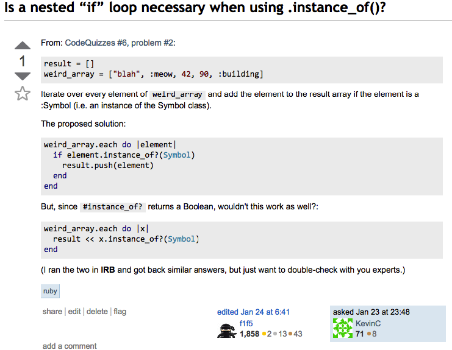

{{ page.title }}
================

03 October 2014 - San Francisco, CA

Vague questions beg for vague answers, whereas specific beg for specific answers. In learning something new, I think you need both to master the material.

####Contextualize, Contextualize, Contextualize Your Questions
When you first ask a friend for help, the question is seemingly simple:  "How do you time manage?" But it's not. Time management is a complex idea. In order not to receive a complex, vague response, it's necessary to constrain the questions -- give it limits.

One way to do that is to specify it with context:  "How do you time manage your day-to-day activities?" In phrasing the question this way, the answerer senses that the questioner is interested in planning the daily, reoccuring tasks. The questioner is not interested in "How do you time manage your week?", which asks for a broader, holistic planning tips.

To stretch the conversation further and fish for specific use-cases, all you need to do is double-down on the context:  "Well, how do you time manage activities that, while not daily, pop up on a regular basis?" This question will probably get to the crux of what you're trying to answer. But, just in case, it doesn't hurt to ask a third time -- this time with an example:  "...say, like your dad or mom calling you?"

One thing to note is that, when starting out a conversation, it's usually best to save the most specific and contextualized question for last. If you ask a broader question like "How do you time manage your day-to-day activities?", you'll usually receive more information that'll lead you to different follow up questions. If you're lucky, the answerer may even answer your specific question without you spending the time to think of it.

####Programming Questions

When asking programming questions, these same rules apply. (1) Ask the problem as broadly contextualized as possible (2) Specify the problem even more with examples -- note what you have tried.

The only difference is that programming questions require both. Without providing examples, it'll be nearly impossible to get an answer to any programming questions.

Imagine trying to answer this question: 
*Is a nested "if" loop necessary when using .instance_of()?*
*
Doesn't make much sense right? When examples are provided, the question make much more sense. (Try reading through the post, THEN re-read the question.

As you can see, I give an example of what I am trying to solve in "proposed_solution". That works. But then, the second block of code - which is seemingly similar -- doesn't seem to work at all.

Luckily, because the question was asked the "right" way, I got a [stackoverflow answer.](http://stackoverflow.com/questions/21321722/is-a-nested-if-loop-necessary-when-using-instance-of)