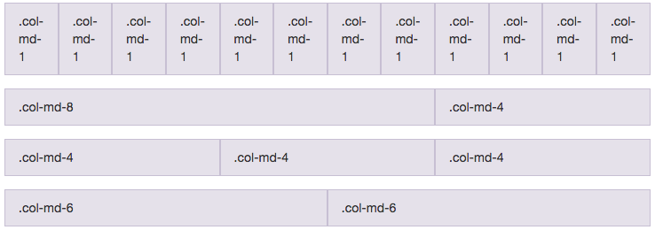

#Sunday - 10/5

#####Personally...
I'm ambivalent about the whole DBC experience. Had I gone to DBC from the start of my education, I think the DBC experience would be worth the time and effort. However, now that I've spent almost a year teaching myself (since Jan. 2014) and now that I feel comfortable with self-teaching myself, I think I could teach myself all I need to know to get a job.

So why am I still going through with DBC? Because I have little time to waste, which means that I still don't have complete faith in my abilities. 

In 9 weeks, I am guaranteed some level of competency. Even if 50% of the material is repetitive for me, I figure I still can learn something. 

Whereas, if I spend 9 weeks by myself, it's doubtful I'll learn *exactly* what I need to know to get a job as a full-stack engineer. 

#Monday - 10/6
#Encoding, Decoding, and Pairing

Today's Highlight:  Multiple Pairings in A Day

Today, we paired. A LOT. In three hours, we rotated through three different pairing partners. It was frustrating because it wasn't enough time to acclimate and actually learn the answer to *any* of the coding challenges.

Our teacher, Sherif, says coding wasn't the point. Instead, we needed to focus on the experience.

I can see how people really like DBC. The instructors really are uplifting and do believe in the DBC philosophy of teaching people to become "Olympic learners". Apparently, programming is easy; learning ruby is an afterthought. Our teacher, Sherif says DBC is not about programming, it's an afterthought of what we do. What we're supposed to be doing is become Olympic Learners. So their job is to push us to the limits of what we thought possible.

We learned that to support us, we'll have access to supportive coaches, meetings, yoga, and life coaching.

#####**Reservations**
These are all great. But for me, after four months of hell. Not just caulking, grouting, and landscaping the house in silence for up to 8 hours in the blazing, humid Virginia summer, but also *learning how to caulk, grout, and landscape.* Suffice it to say, I've already passed the initial shock of anything "surprising" in Life.

At times, I like to remind myself:  I have a date with eternity. And so, if I am already living in an endless experience - what's there to stress about? Eternity is here and now? And, eternity could end any moment.

If I already understand this, then what's the point of going through DBC? I don't have *that* much stress to manage. If I'm already interested in learning how to learn and am optimizing on that, then programming for me is already an afterthought.

I'm still not sure if I like Dev Bootcamp, but I know that I'm still going to stick through. Unfortunately, to gain something, I recognize I have to undergo pain. After this summer, I've decided that I would take on pain. It may be painful to stay at Dev Bootcamp, but I hope to at least get a "good"" grounding in practical programming.

#Tuesday - 10/7
#Encoding, Sorting, and Searching

Today's Highlight: Pairing with One Person All Day

#####Personally...
I emailed the Mixpanel recruiter from two months ago. Just realized that I hadn't actually sent him a reply. In any case, I'm kind of fed up. So far, we've been coding up Ruby challenges that I find repetitive. By no means are they easy, but they're challenges that I could've figured out by myself, searching StackOverflow and GitHub.

Moreover, there are so many activities embedded within DBC -- lectures, yoga, empathy sessions -- that I think detract from getting really good. 

1. I already have friends that I can ask for help. They're not as readily available as DBC coaches, but they sure cost A LOT less.
2. I already do Tai Chi, which is personally more fulfilling than Yoga. Though I do like Yoga once in a blue moon, it detracts from my road to mastering Tai Chi.
3. Empathy sessions are important, but like things worthy of learning:  They can't be taught in a several lectures or meetings. People have to care deeply and be willing to get hurt for some greater purpose.

#Wednesday - 10/8
#Data Structures

Today's Highlight:  First Solo Wednesday

I'm surprised at the pace and the energy of DBC. I still have reservations about the program. While they like to say that DBC invites people to take responsibility for their education, I have to say that this is only a consequence (or confluence) of *personal* situations:  People come to DBC with a more fully fleshed out purpose than do kids attending college.

I would argue that the quality of the instruction and the lectures themselves aren't that deep or theory based. Not that they should be; DBC is a technical school. However, I would think that $12k would pay for a higher standard of understanding.

That said, after our first solo day today, I guess it is worth paying $12k for some quality control on my DBC peers. Working with fellow peers (no matter their level of their programming experience) so far is great - surprising. Despite coding in complete focus for 10+ hours a day (not counting lecture time). I'm not as tired as I figured I would be. 

Perhaps it's that I'm more mature after going through 4 months of family troubles. But perhaps its because I am feeding off the nervous and excited energy of the other students. 

On another note, I took a call from a recruiter at Mixpanel. Apparently, listing myself as "Web Developer" despite not having any polished programming projects does work. Moreover, I seems to illustrate that the level of competency needed to get an (support) engineering job is very low; that or going to Brown did help in getting a job. Probably a bit of both. 

I wonder if I instead spent 9 weeks learning what I wanted to learn, I could get the same job coming out of DBC. A couple of the coaches are and had worked as a support or solutions engineer before moving onward.

In any case, I'm not going to quit. Spent way too much money already. Opposite the theory of economics, I'm going the zen approach:  I said I would do it, so I just have to really **fucking** do it. I have to push myself much more -- I'm going to get an engineering-focused engineering job.

To that end, I'm toying with the idea of working with Tim on the weekends. I can't wait to touch a real product and learn some Backbone.js.

###Data Structures Notes

-	**Stack**:  Is like a stack of plates. Data goes on top of each other. To get the data off, you have to take from the top of the plate pile. In essence, that means you `#push` values and `#pop` values from the array
-	**Queue**:  Is basically a waiting line -- literally a line that you wait in. People come into the line, and the *first ones in* are the are also the *first ones out*. In an array queue, that means you `#unshift` data into the queue and `#pop` that data out.
-	**Linked Lists**:  Is like people waiting in line, but with invisible strings attached to each other. When the second person is placed into the line, he is automatically attached to the first person; the second person can't help but follow the first person. It is through these invisible ties or *links* that a link list is created. Linked lists can be arrays (`[val, [val,[val,nil]]]`), hashes (``), etc. (I don't know what the etc. might be.)

**In working with hashes, remember a few things:**

1.	As of Ruby v2.0, hashes are unordered. To access and retrieve information from a hash, you have to convert the hash to an array (`#to_a`).
2.	When turning an array into a hash, try to find a the nested array that will be the hash keys. Then, define the rest of the nested array as hash values. From there, you can `keys.zip(values)`. 

**In working with regular expressions:**

-	To substitute several parts of an expression, bunch the Regex with parentheses `()` and use a `#gsub`; second argument should have a `\1` up to the last number `\n`. So, to ensure that the following SSN have a dash in-between
	
	SSN: 480.01.4430, 480014430, 480-01-4430
	string.gsub(/(\d{3})[\D]?(\d{2})[\s\W]?(\d{4})/, '\1-\2-\3')

-	For optional Regex values, use a `?` after the value.
-	For either or Regex values, use `[]`. Hence, the above code looks for `\s` OR `\W`.

#Thursday - 10/9:  
#Part 1: Test-Driven Development:  An Example

Today's Highlight:  Slow Down and Program Faster with TDD

Great code doesn't come from omniscient programmers -- ones who seem to be able to code programs in 1-10 lines that's fully extensible to all use cases. Great code comes from keeping things simple. From simplicity comes great code. 

Today, Dev Bootcamp teacher Miles talked to us about the importance of designing (architecting?) a program. Each method and variable must be properly named -- essentially, you ***want*** to spend significant upfront energy and time (probably 60% of your coding time) to get to the philosophical underpinnings of what you're coding.

For example, to create a method that will calculate change for a dollar, we want something pithy like `make_change`.

	def make_change(cents)
		change = {}	
	end	

Moreover, we know that we will want to return the `change`. And, we want to be able to return the change and have it readable by calling for : `:quarters`, `:dimes`, `:nickels`, and `:pennies`. 

Next, in writing the `make_change` method's inner operations, we want to make sure we're actually writing usable code. That's why we need to use tests.
	
	def test(expected, actual)
	  passed = actual == expected
	  unless passed
	    p expected
	    p actual
	    raise "Test failed"
	  end
	end
	
	test({}, make_change(0)) 
	test({:pennies => 1}, make_change(1))

In trying to make the first test pass, what code would you write? All you need to do is return an empty hash. 

What code would make the second test pass?

	def make_change(cents)
	  change = {}
	  if cents >= 1
	    change[:pennies] = cents      
	  end
	  change
	end

Next, our test ask for:

	test({:nickels => 1}, make_change(5))
	test({:nickels => 1, :pennies => 1}, make_change(6))

Our code thus becomes:

	def make_change(cents)
	  change = {}
	  if cents >= 5
	    change[:nickels] = cents % 5
	    cents = cents % 5
	  end
	  if cents >= 1
	    change[:pennies] = cents   
	  end
	  change
	end

As we can see, we more or less the same loop. If we were to extend the code to handle cases for `:quarters` and `:dimes`, the same four lines would occur again and again. Just write it out to see. 

Seriously, write it out.

***Only after all your tests pass can you refactor the code. Refactoring code that doesn't pass all the tests is to refactor broken code.*** Finally, we arrive at the "genius-level" code:

	def make_change(cents)
	COIN_VALUES = {:quarter => 25, :dimes => 10, :nickels => 5, :pennies => 1}  
	change = {}
	  COIN_VALUES.each do |coin, value|
	    if cents >= value
	      change[coin] = cents / value
	      cents = cents % value
	    end
	  end
	  change
	end	

#Personally...
I'm warming up to Dev Bootcamp.

#Thursday - 10/9:  
#Part 2: When To Make Variables `private`

Today's Highlight:  Instance Variables are *Automatically* private to a Class.

If, say, a `BankAccount` class were a circle, how would other classes (or actual people) access information (move back and forth through the circle boundaries) and possibly manipulate information inside that `BankAccount`? Well, that's what accessor methods are for. Think `attr_reader`, `attr_writer`, `attr_accessor`.

However, what happens if you want to make the information ***inaccessible*** to any object outside of the class? You could declare `private` like so:

	class BankAccount
	private
	attr_reader :acct_number  ### see here
	
	public
	attr_accessor :type, :customer_name

	  
	  def initialize(customer_name, type, acct_number)
	    @customer_name = customer_name
	    @type = type
	    @acct_number = acct_number
	  end

	   ...
	end

However, this is unnecessary and tedious for most programs. Generally, you can leave the `attr_reader :acct_number` out entirely. Instead, use the instance variable denoted with `@` so that the instance methods can access the variable within the class.

	class BankAccount
	  attr_accessor :type, :customer_name

	  def initialize(customer_name, type, acct_number)
	    @customer_name = customer_name
	    @type = type
	    @acct_number = acct_number
	  end

	  def to_s
	    "My account information is #{@customer_name}: #{@type} #{masked_account}"
	  end

	  def masked_account
	    ### see here 
	    @acct_number.gsub(/(\d{3}\W?\d{2})(\d)\W?(\d+)/, '*****\2\3')
	  end
	end

**Thanks to Brick Thorton who taught Yash and me this.**

#Personally...

I'm liking Dev Bootcamp more and more. 

#Friday - 10/10
#Programming Sudoku (with Sudocode)

Today, my pair Kiope and I doubled down on *going slow* with Pseudocode and Test-Driven Development. 

It took us almost two hours to write a full draft of Pseudocode with properly named methods and variables, but pseudo-coding was a huge boon to communication. We still had hiccups - points where we weren't on the same page, but, overall we were. And we moved a lot faster through coding than had we not pseudo-coded.

Moreover, TDD made it feel like we were in control. Instead of coding up a monster method, TDD forced us to breakdown our method into the smallest component parts. Not only were the methods then easier to debug, but TDD helped us get into a state of *flow* -- and avoid a state of frustration.

#Friday - 10/10:  
#Recursion
Today's Highlight:  Recursion is a like a Escher Staircase -- just with a "Stop Sign"

Usually, when recursion is taught, math and/or code is used. Today, Sherif showed us the best visual image for what recursion is. But before we get to that, let's look at some code.

	def do_it(counter)
	  puts "on the way down, #{counter += 1}"
	  return counter if counter > 3              # you can return from the base case
	  counter = do_it(counter) - 1               # and use that value
	  puts "on the way up at level #{counter}"
	  counter                                    # but line 151 now expects a return value!
	end

As described in the [Little Bastard's Book of Ruby](ruby.bastardsbook.com/chapters/recursion/), for recursion to work, we need a (1) a procedure and (2) a base case.

While it can be difficult to wrap your head around recursion, here's what you need to know:  Have the program do the same thing until the base case says "STOP."

As the sample output illustrates, recursion is like going down a set of stairs.

	# on the way down, 1
	# on the way down, 2
	# on the way down, 3
	# on the way down, 4
	# on the way up at level 3
	# on the way up at level 2
	# on the way up at level 1

You do one thing on the way down four times. Then, you hit the base case which tells the procedure to STOP. Next, we run the rest of the procedure (if any other code exists); in this case, we go back on the way up.

INSERT IMAGE

#####Personally...
After the first week, is Dev Bootcamp worth $12k? 

I'm still not sure. But, the value of Dev Bootcamp is up there. While the teachers don't seem to help *that much* during the coding challenges. It's not like they should. All of us students must figure out coding for ourselves and with each other (through pairing). I think the teachers do just enough and come in at just the right points to make sure that we are learning and not just refactoring or reading random blogs.

Moreover, I think Dev Bootcamp has done a fairly good job with coordination -- making sure fellow students are driven to be here.

The verdict is still out on Dev Bootcamp is out. My guess is that it's worth it, but I'll have to wait and see to believe.

#Monday - 10/13:  
#Part 1:  Inheritance vs. Composition

Today's Highlight: Composition over Inheritance?

Chances are you've heard of Inheritance, but what of Composition? What is it? Why do programmers often say "composition over inheritance"? (Dev Bootcamp makes no opinion on one or the other.)

To put it simply:
1) Composition is used when you can say an object "has-a" relationship. 

Take for example, that you want to build a mountain bike. You think about it real hard, and you realize you can use Composition. So, the only classes you create are `Bicycle` and `Parts`. And to build the mountain bike, we'll build `mountain_parts`. Then, call the `mountain_parts` into a new instance of `Bicycle` called ``mountain_bike`. For more information, the driver test code might look like this:

	mountain_parts = Parts.new({wheel_size:29, tire_type:"Big", rear_sus: "lots"})
	mountain_bike= Bicycle.new(15, mtnbikeparts)

Inheritance is used when you can say an object "is-a" relationship. With inheritance, we might create a `MountainParts` and `MountainBike` class that `<` from their relative superclasses `Parts` and `Bicycle`, respectively.

However, if we were to do that, then every time we changed the `Bicycle` class, we might have to change the inside code of `MountainBike`. Using composition, we can ensure that `mountain_bike` always has features that are up-to-date with `Bicycle`.

#####Personally...
I don't recommend taking the weekend off or working on side projects during Dev Bootcamp. Everyone is there for a reason, and taking, probably, more than a day off is too long -- my newfound knowledge will probably fade away. I need to keep the momentum moving throughout these 9 weeks.

More than that, I need time to recharge.

Dev Bootcamp is what I make of it. So, I need to put in more hours to stretch myself.

#Monday - 10/13:  
#Part 2:  Reading/Writing Files

Today's Highlight:  Reading/Writing Files with a "Castle"

Dev Bootcamp Coach Alex gave me an almost perfect example of how to decode the little letters like `r`, `r+`, `w`, `w+`, `a`, `a+`...

You might find this code in lines like this:
	File.open("some_file.csv", "w+") do |file|
	   file.write(some_file.to_yaml)
	end

Think for a second that you're an Army captain. Today, you want to *add a few soldiers* (or "write") to the castle's infantry ("the file"). 

Unfortunately, you're a low-level captain (`r`). So, you can only list off the names of the soldiers already inside the castle. And, you have to start at the beginning of the morning drill line.

Now, you're an `r+` captain. So, you can add a new soldier and *even* change (write over) any soldier's name at will. The only thing is you're still an `r`, so you have to start from the beginning of the line -- even if you just want to add the new soldier to the end of the line.

(A few more important ones..)

As a `w+` captain, you can change the name of any soldier. But, if the physical castle doesn't exist, you first create the castle (the file), *then* put your soldiers inside, and *then* start changing names.

As a `a+` captain, you start *at the end of the file*. If the castle doesn't exist, you create it. Then, you can start adding soldiers to the end of the line.

#Tuesday - 10/14:  
#MegaMoths

Today's Highlight:  Paring Down MegaMoths

Simply put, any method that seems to go on *forever*; like, if it has 10+ lines of code with array indices or hash calls, then you probably want to simply the method into many methods.

If you still want the methods to run seamlessly, well, there's no hurt in creating an `#execute` method that calls all the method you want to run at once.

Today's Highlight:  MetaProgramming

Until today, I didn't understand why Ruby is *better* in some ways to other languages, like Java.

The short answer (from our teacher Sherif) is that you can *metaprogramming*.

Take for example this situation. You want to create cookies and then be able to batch the cookies into different groups. You could write the classes with Inheritance or Composition. However, there's a far simpler way to do this.

First, we can just create a `Cookie` class and initialize any cookie to be any type with `instance_variable_set` like so:

	class Cookie
	   def initialize(cookies_param = {})
		cookies_param.each do |k, v|
			instance_variable_set("@#{k}", v)
		end
	   end
	end
			
Essentially, instead of constantly setting `attribute_name` to `@attribute_name` in the `#initialize` statement. The `#instance_variable_set()` *combined* with a hash (`cookies_param`) allows us to create new instance variables on the fly.

Don't believe me? Just run this code yourself:

	ingredients = %i[sugar flour eggs milk]
	flavors = %i[peanuts chocolate sprinkles]

	cookies = Array.new(10) do
	  Cookie.new(ingredients: ingredients, flavors: flavors.sample(1), cooking_time: rand(10..20))
	end
That's great and all. But, one thing we would like is to batch our cookies into different flavors. Y'know, some people have peanut allergies, so let's separate them.

Now, I could create a `#batch_cookies` method, but that's inflexible. With `#method_missing`, we can automatically batch the cookies without writing out the full method.

	class Cookie
	  ...
	  def method_missing(args)
	    flavors = args[0..-2].to_sym #:milk
	    @flavors.include? flavors
	  end
	  
	cookies.select(&:peanuts?)
	#=> [#<Cookie:0x007fabe3118190 @ingredients=[:sugar, :flour, :eggs, :milk], @flavors=[:peanuts], @cooking_time=13>, 
	#<Cookie:0x007fabe390bf50 @ingredients=[:sugar, :flour, :eggs, :milk], @flavors=[:peanuts], @cooking_time=16>, 
	#<Cookie:0x007fabe390b410 @ingredients=[:sugar, :flour, :eggs, :milk], @flavors=[:peanuts], @cooking_time=18>]

As you can see, we're looking for cookies return `true` for `#peanuts?`. But instead of actually creating the `#peanuts?` method, we ask `#method_missing` to find any missing methods and run the block of code shown. Here, the `#include?` statement essentially acts as the `#peanuts?`.

#####Personally...
I'm really tired. Maybe I'm sick. I'm not getting enough sleep. But, more than anything else, I feel like I'm behind. That I should be farther in the challenges and in my learning.

Once again, there's nothing I can do besides continuing to work on the process:  Manage my sleeping, what I eat, who I spend my time with. I have no more time anymore and to grasp the opportunities at Dev Bootcamp I need to optimize my learning. That means reading books and redoing the *important* challenges.

Of course, I shouldn't push myself too hard. Everyone comes to DBC with similar feelings.

In Engineering Empathy, we learned to deal with our Super Egos -- the part of your brain that seemingly criticizes every action you make. Or, in other words, it's that nagging voice in your head that you are too old, too young, too fat, too stupid, and too whatever to be great at anything and everything.

At first, this all seems like pretty simple stuff. Learn to deal with yourself. However, when you're in a competitive atmosphere like Dev Bootcamp, the reality is that you can't help but compare. For example, to say that you are behind is to acknowledge that there is a comparison going on. 

However, it's often the simplest things that are hardest to overcome.

When we finally connected to each other today, I learned that more than one person I thought was "smart" felt like they were 'too slow'. It's small bit of solace, but it's solace nonetheless. Now, I can take whatever energy was boxed up worrying and put it towards becoming better.

I can't wait for the weekend to get some rest/extra work done. I really need a break.

Talking with Sefora, the Dev Bootcamp Life Coach, was helpful. After telling her my whole story for the past year, I came to my own realization that I need a break for myself. Since my dad passed away in April, I've had little time to really think about anything except execution:  Fix the lawn, Call my dad's retirement accounts, Teach mom how to manage her finances, Remodel the bathrooms, and now Learn programming. So many tactical...tasks...really does burn one's energy. It leaves no time for big thought, revelations. 

Questions:  What is Duck Typing?

#Wednesday - 10/15:  
#MVC

Today's Highlight:  MVC is Simpler Than You Think

Don't you hate it when you have a 200-300 line program, all running in the same ruby file? Don't you *especially* hate mega-classes that seem to do everything -- from interacting with the database, structuring and modifying the data, and presenting that data in a readable format in terminal?

All in all, it's a lot to manage. And because it is so complex, there's a likelihood that things will break in the future. Whether you need to add a new method to splice the data or just want to print out a new message to the console, relying on 250 lines of code to work perfectly as a whole is a bad idea.

With MVC, we can *separate the concerns* into:
1) Models:  Or, the Classes that interact with and store the information from the Databases
2) Views:  Or, the `puts` and `print` statements that the user can physically see and interact with.
3) Controller:  Or, the "middle manager" methods that take commands from the Views and sends it to the Models, and vice versa.

As the Model is essentially the guts of the program that I'm sure you're familiar with, I'll only show the View and Controller.

Here's the View:

	class View

	  def self.display(list)
	    puts "------CURRENT LIST--------"
	    list.flatten.each_with_index do |task, index|
	      puts "#{index+1}. " + task.to_s
	    end
	  end

	  def self.appended(new_task)
	    puts "Appended #{new_task} to your TODOs..."
	  end

	  def self.deleted(new_task)
	    puts "Deleted #{new_task} to your TODOs..."
	  end

	  def self.completed(new_task)
	    puts "Completed #{new_task} to your TODOs..."
	  end
	end
	
In the view, you get what you can see - literally. It may interact with the `List` model like in `#self.display`, but the key here is that the View actually doesn't need to know anything about the model. `list` (lowercase) is just a parameter. Looking below at the controller, the View should make more sense.

	class ListManager

	  def initialize
	    @my_list = List.new
	  end

	  def run
	    View.display(@my_list.task_list)
	    command = ARGV[0]
	    new_task = ARGV[1..-1].join(" ")
	    task_id = ARGV[1].to_i
	    case command
	    when "list"
	      View.display(@my_list.task_list)
	    when "add"
	      View.appended(new_task)
	      @my_list.add_task(new_task)
	      @my_list.display_all
	    when "delete"
	      View.deleted(new_task)
	      @my_list.delete_task(task_id)
	      View.display(@my_list.task_list)
	    when "completed"
	      View.completed(new_task)
	      @my_list.completed_task(task_id)
	      View.display(@my_list.task_list)
	    end
	  end
	end
	
Now, I admit that the variable and method names are not well-defined. So, it's probably hard to read this code. But if you stick it out, you'll notice that you call the View using class methods (hence the `self.` names in the View). 

More importantly, the `ListManager` controller illustrates an important point. Since it is the thing that calls creates an instance of a model `@my_list`, the controller is also the class that calls all the methods of the model. (Read that again)

By separating the concerns of the program into MVC, we have simplified the our program execution to two lines:

	my_manager = ListManager.new
	my_manager.run
	
#####Personally...
I'm proud of myself today. As Wednesdays are "solo days", I decided to test myself by creating this program on my own. At first, I thought I'd probably give up and work with someone else (I even asked two people ahead of time). But, I didn't need to. More importantly, at no point was I panicking. All thanks to focusing on the Test-Driven Development process.

Instead of trying to build the whole ToDo list program out of my head. I instead try to build upon small wins. First, I wrote down the methods as if I were to execute them. Then, I would run the method -- even before typing anything inside of them. 

By *purposely* failing first, I felt a sense of accomplishment which helped me forge onward as I wrote the method, tested it again, and failed until I succeeded. I want ***you*** to understand this:  <u>The philosophy of programming is to succeed by failing a lot and in little places.</u>

While I started out slow, I found myself not at all behind. I had plenty of time to help my other cohort mates.

#Thursday - 10/16:  
#Databases

Today's Highlight:  One Table to Rule The World

My pair Tom and I were given the problem to model the database for a family tree. Here were the requirements:

1. 	People have a first name, middle name, birth (last) name, legal (last) name, gender, and birth date

2. 	Come up with a way to relate people. You should be storing the data in a way that permits constructing a family tree, and also answering questions about a family tree, e.g., "Who is this person's parents?", "Who are Steve's paternal ancestors?", "Who are Dora's descendants?", "Who are Steve's cousins?", "Who are Lila's granddaughters?", etc.

The answer? It's just one table called `Persons`. A person has all the usual attributes `name`, `birthday`, and so on. But, the person also has a mom and a dad. So...the person should have a `mom_id` and `dad_id` that map to a different person on the list.

To get the mom and dad of a particular person, you would query something *like* (not 100% sure here): 

	SELECT *
	FROM persons
	WHERE mom_id = id and dad_id = id
	
That's it!

#####Personally...
Sherif tries to make Thursday a day of decompression. And, boy was a breather needed. I woke up late today. To compound that stress, all the tension in my body from sitting and even standing while coding is going straight to my stomach. Maybe it's because my back and shoulders are so tight that now the stress is working it's way to my stomach.

It's days like today that I appreciate that Dev Bootcamp provides free yoga. It was as if the instructor was reading my mind -- we stretched our psoas and massaged our backs with a cushy, rubber ball. 

Moreover, I appreciate that Sherif planned out this Thursday as more of a talking day. Tom and I designed databases on a white board. We actually only spent about an hour or so coding up a database -- just enough to get a practical understanding of the topic.

#Friday - 10/17:  
#MVC w/Groups

Today's Highlight:  Working With Groups is Tough

Technically, there wasn't much to deal with today. We built a flashcards game in the command line in an MVC type format.

#####Personally...
I think we should have stubbed the whole project. Had we given each person something to work on, rather than worrying about pairing on different parts (so 4 groups of 1, rather than 2 groups of 2), we would have finished a lot quicker.

However, that was impossible because communication was crucial. While we spent the time needed to (1) talk about the problem, (2) pseudocode by figuring out our (2a) nouns or classes and (2b) our verbs or methods, failed to be EXPLICITLY clear about the input and output. 

Of course, we said, we want to return a value. However, had we simply wrote out exactly what we were looking to output - be that as hash of keys or and array of objects (ex: `{term: "yolo", definition: "you only live once"}`), then our brainstorming session and pairing would have been much smoother.

In short, also *write out* what the (A) input and the (B) output will look like before moving onto (C) how to design the program.

#Monday - 10/20:  
#Object Relational Mapping 

Today's Highlight:  ActiveRecord Isn't Magic with ActiveRecord 'JR'

INPUT IMAGE:  SQL-RUBY-MODEL

`ActiveRecord` is the Rails Object Relational Mapper. But, let's slow down first -- what is an ORM?

It simply *maps* the Ruby classes and *objects* to *relations* in the Database. 

More explicitly, Ruby classes are database tables. Instances of the class are table rows. And instance variables are table columns.

INPUT IMAGE:  ANIMATED-ORM

Whether your database is SQLite3 or PostgreSQL or something else, `ActiveRecord` is a way to *translate* the Ruby code into SQL commands. Once those SQL commands are done CRUD-ing the data, the data gets pushed back to Ruby through the model (see image). After converting that data into Ruby objects, you can do whatever you want. Perhaps even create the next Facebook.

#####Personally...
I really feel in my element now. As I've been playing around with Rails apps for several months, the concepts behind the challenges are finally solidifying. Dev Bootcamp is helping me fill in all the holes in my Rails logic. 

Today, we also had a mock assessment for the end of Phase 1. We were given three problem -- five minutes each -- to solve. Under those time constraints, I was happy to say that I was able to maintain my composure and breath through the assessment. Now, I don't have to do the real one with Sherif. 

That said, some of my peers are really stressed that they may be held back. I wish there was something I could do to help. But as we're already required to pair for most of the day, there seems to be no time. I wish Dev Bootcamp had more active coaches or teaching assistants. Sherif is looking for ways to make an auxiliary staff (more available. At the moment, nothing seems like it's going to change soon.

#Tuesday - 10/21:  
#ActiveRecord Overview/Review

Today's Highlight:  Setting Up Databases And Playing With ActiveRecord

Today, we were given a several plug-and-chug exercises. That by no means that it was an easy day. For some, I'm sure their heads were spinning. For me, the challenges were a great way to hone down the basics of what all the files and classes mean in ActiveRecord.

-	`config/environment.rb`: requires the gems and ruby files needed, then it loads the model files and sets up the database connection. Essentially, it set ups the *environment* for the app to run.
-	`Rakefile`: contains domain specific language (DSL) with set tasks to help get our application up and running. Namely, it has all the useful `db:` commands
-	`db/migrate`: contains the all the migration files (or changes to the database). there are multiple migrations so that you can change your database step-by-step as opposed to making it magically appear (or disappear).
-	`Gemfile`: is a list of gems and the gems' specific version needed to run the file 
-	`Gemfile.lock`: is a list of the *exact* environment known to let the your web app work correctly. Hence, you 'lock' or keep this file because -- in the worst case scenario if your gems' versions are off -- others may want to reference the file for future use.

Other tidbits:

-	`ActiveRecord::Associations::CollectionProxy`: is an object that behaves similarly to an array. When you set-up associations and ask a `Dog` for it's `Person` (owner) in `Dog.find(1).owners`, you'll get a *collection* of owners associated with the dog.

#####Personally...

I'm doing well. I talked to Sefora, the Dev Bootcamp life coach, today and I have to say having someone to talk to.

As the end of Phase 1 nears, I had started thinking about what I want to do after Dev Bootcamp. Not because I'm waiting to graduate and find a job, but because I want to keep learning. I applied to Hacker School before Dev Bootcamp, and I still think I'd like to attend. 

While Week 2 and Week 3 so far has been good in honing down the basics of MVC and ActiveRecord, I definitely want to get better at some core computer science-y topics. Moreover, I want to build more command-line centric things before I really start honing into web and mobile apps. At the end of the day, I think since technical knowledge builds upon the basics, I want more practice on just that.

For now though, I think I'll take Sefora's advice. Dev Bootcamp is short -- I should be with it for now. Don't worry about taking a few months off applying to Hacker School. Just get the most out of Dev Bootcamp for now.

#Wednesday - 10/22:  
#More ActiveRecord

Today's Highlight:  Symmetric Migrations

When writing a migration, typically ActiveRecord (and Rails) simply uses the `change` method, like below:

	class ExampleMigration < ActiveRecord::Migration
	  def change
	    create_table :products do |t|
	      t.references :category
	    end 
	  end
	end

So, when you call `rake db:rollback` or migrate to a previous version of the database, ActiveRecord can call its implicit `down` method to undo any changes that you may have put `up`.

However, sometimes you may run into problems. For example, you may want to create a `name` from a student's `first_name` and `last_name`. So, you'll actually have to write a bit of ruby to create the `name` attribute in your database.

	class AddColumnName < ActiveRecord::Migration
	  def up
	    add_column :students, :name, :string
	    add_column :students, :address, :string
	    Student.all.each do |student|
	      student.update_attributes! :name => student.first_name + " " + student.last_name
	    end
	    remove_column :students, :first_name
	    remove_column :students, :last_name
	  end

Here, we add the new column, and delete the old attributes `first_name` and `last_name`. 

A few years pass, and now the principal wants back the `first_name` and `last_name` attributes. Unfortunately, you can simply rollback to an old version. You don't have the `change` method -- so you have to explicitly create your own `down` method to drop the table:

	   def down
		add_column :students, :first_name, :string
		add_column :students, :last_name, :string

		Student.all.each do |student|
		  student.update_attributes! :first_name => student.name.split(" ")[0]
		  student.update_attributes! :last_name => student.name.split(" ")[1]
		end

		remove_column :students, :address
		remove_column :students, :name
	   end

#####Personally...
I'm just tired physically. Mentally, I think I can be pushed more. I've been learning a few cool tidbits here and there this week, but not sure if it makes up for all the other stuff.

#Thursday - 10/23:  
#More ActiveRecord 

Today's Highlight:  Really Understanding The Difference Between `.build` and `<<`

Say, you're a teacher in kindergarten. As such, you have lots of students. And, given the nature of moving families, you may get new students half-way through the year. You need a way to associate a `teacher` and new `students` in the database. (You must have already set-up the association in the model.)

To create the association in ActiveRecord, ask for the teacher's *association collection* with something similar to `teacher.students`. This should return all the students with the same teacher id *in an array*.

Because the association collection returns an array, you can perform array-like operations on the collection. Namely, you can use the shovel operator `teacher.students << Student.new(...)`. The shovel operator instantly fires *update* on SQL without a `.save` or `.update` on the parent object.

###`.build`

While in previous Rails versions, many took `.build` and `.new` to do similar things. I think `.build` is closer to `<<`. 

`teacher.students.new` would create new student. However, it's neither *added* or *saved* the the `student` collection.

`teacher.students.build` would create the new student, *and* place the student in the teacher's `student` collection. However, the new student would *not* be saved. So, you have to save the student manually.

#####Personally...
I'm just okay. Normally, I'd be fed up. But, it's normal that at some point I'd be working with someone who is a little behind. I was paired with someone who seems like she'll be repeating Phase 1. 

So while it was good to dig deep and be forced to explain every little thing that was happening, I was pissed that I didn't get to drive faster and harder at the problem. 

I want to go deeper into my studies, while Dev Bootcamp keeps asking that we go for breadth. I think I already have that.

#Friday - 10/24:  
#Phase 1:  Group Projects

Today's Highlight:  Messing Around with Twilio API

The Twilio API is pretty simple. To get started all you need to type is `require 'twilio-ruby`, and then `bundle install` the gem. From there, you simply copy and paste your `accountsid` and `auth_token` from your Twilio account.

From there, you instantiate a new Twilio client object with:
`client = Twilio::REST::Client.new account_sid, auth_token`

Now, to send texts to all your friends, create a hash with their phone number. (Don't forget to verify their phone numbers on Twilio.)

	from = "+14159998888" # Your Twilio number
	 
	friends = {
	"+14153334444" => "Curious George",
	"+14155557775" => "Boots",
	"+14155551234" => "Virgil"
	}

Finally, just loop through your friends, and send them each a message.

	friends.each do |key, value|
	  client.account.messages.create(
	    :from => from,
	    :to => key,
	    :body => "Hey #{value}, Monkey party at 6PM. Bring Bananas!"
	  )
	  puts "Sent message to #{value}"
	end

Pretty simple.

#####Personally...

We didn't do much of anything again today. Dev Bootcamp had graduation day (which happens every 3 weeks). That combined with the fact that our cohort is super chill, we didn't do much of anything. One group actually just hung out all day on the couch.

I'm kind of disappointed that we weren't really programming, pushing my boundaries today. But we all need a rest. Moreover, it was good to dive deeper into the Dev Bootcamp culture.

A student, Ruskin said it best. Most of the lectures are just okay. However, what Dev Bootcamp really adds is the cultural on boarding -- making sure all the students abide by a set of rules so that the place is safe to explore. 

Unfortunately for many of us, Dev Bootcamp focuses a bit much on beginners. And with the lack of teachers and coaches, it feels like some of us are simply teaching other students.

Next week, starts Phase 2, a dive into front-end technologies. It's exciting, however there are also ~10 people repeating Phase 2. Meaning, our cohort just grew from 30 to 40. 40 people, just one or two teachers.

#Monday - 10/27:  
#Phase 2:  First Day With Sinatra

I didn't spend any time learning Sinatra over the weekend (I was busily learning Rails), so today was interesting.

To be honest, I don't like Sinatra much at all. It seems like you have to do so much of the heavy lifting as a programmer -- from writing custom routes (as if they were HTTP parts) to even managing the controller from getting to 
"fat".

In any case, it has helped drill in some points about web development. Namely, you can specify the routes however you like:

	get '/' do
	end

	get '/grandma' do
	end

Moreover, Sinatra forces you to actually specify which HTTP action you need to hit:

	post '/grandma' do
	  hello = params[:user_input]
	  if hello == hello.upcase
	    hello = "#{hello}, I HAVE NOT SINCE 1979."
	    redirect "/?grandma=#{hello}", 303
	  else
	    hello = "Speak up, kiddo!"
	    redirect "/?grandma=#{hello}", 303
	  end
	end

Here, the view asks to POST some information to the route above. The route then checks the variable `hello` and redirects to the `/?grandma=#{hello}` route with the corresponding message.
	
###Rendering Views

Like Rails, Sinatra can render views. You can specify which views to render inside the controller:

	get '/:word' do
	  @word = params[:word]
	  @anagrams = Word.anagrams(@word)

	  erb :"anagrams/index"
	end

-	`erb` specifies that you want to create a view, specifically an "embedded ruby file". It's basically an HTML file with the ability to write ruby inside.
-	next, you specify the file you want to reference. Here, we're referencing the `index` view inside the `anagrams` folder (under `views`).

###Creating Partials

Often times, you'll want to iterate through a list and print out the information. Instead of writing all the logic (a `.each` loop), you can create a partial like so:

	  
Show a list of anagrams for "<%= @word %>"

	  <% @anagrams.each do |letter_v| %>
	      <%= erb :"anagrams/anagrams", :locals => {:letter_k => letter_v } %>
	  <% end %>

Here, you are telling the program to render an anagrams (erb) partial. Then, you'll passing in locals variable. 

Next, in the actual `anagrams/anagrams` file, we only need to specify the `letter_k` for the partial to render the actual value (`letter_v`):

	
<%= letter_k %>

#Tuesday - 10/28:  
#Phase 2:  Deeper into Sinatra CRUD

I can't remember how exactly to do forms in Rails, but I'm kinda surprised how much more understandable creating a form in Sinatra is. Perhaps, it's just the fact that I can rely on my Rails experience. But perhaps it's because  Sinatra is different.

###Creating a New Form
To create a form inside Sinatra, we simply need to copy the HTML form template. A few things to know:

-	`action` is the route that we'll be posting the data to
-	`method` is the type of HTTP verb that further specifies the route 

In this `New Article` form, we'll be *posting* the information to the *articles* route. For the sake of example, let's say we created an article with the `title`: "Jack's Piano" and `body`: "100 year's old. Brown.".

	<h1>New Article</h1>

	<form action="/articles" method="post">
	    

	        <label for="title">Title:</label>
	        <input type="text" name="title" />
	    

	    

	        <label for="body">Body:</label>
	        <textarea name="body"></textarea>
	    

	    

	        <button type="submit">Submit</button>
	    

	</form>

###Edit Form

If we want to edit the article, we only need to (1) copy-and-paste the form above. Then, replace the first form tag with this:

	<form action="/articles/<%= @article.id %>/edit" method="post" id="edit">
	    <input type="hidden" name="_method" value="put">
	    
To do this, you need to create a `put` request. The form method remains `method="post"`. However, we will change `post` with a hidden input form (a) using the "magic" `_method` that will allow a put request -- (b) by specifying the `value` as `put`. We do this because [most browsers don't support method other than "GET" or "POST" on forms.](http://stackoverflow.com/questions/7005629/how-to-create-a-delete-form-with-restful-routes-in-rails).

#Wednesday - 10/29:  
#Phase 2:  Building Bit.ly with Sinatra

Today was tough. There were quite a few stretch challenges embedded within today's challenge. In any case, here are a few key topics we covered.

###Error-Handling with "Flash"

After installing the `gem 'sinatra-flash'` inside the Gemfile, you can now *flash* any kind of message you would like to your users. 

Starting with our controller, say you have a route like so:

	post '/urls' do
	  @url = Url.new(original: params[:original])
	  if @url.save
	    flash[:success] = "Transformed word added!"
	    redirect "/"
	  else
	    flash.now[:error] = "Errors in the form!"
	    erb :new
	  end
	end

Well, as you can see, we now have a flash hash object. Depending on whether the `@url` saves or not, a `success` or `error` key is stored.

Let's assume that `flash[:success]` is stored. Well, how would we see the phrase `"Transformed word added!"` in our webpage? For that, we have to look at our `erb` view.

In our layout, we have the following:

	<% if flash[:success] %>
        <button type="button" class="close" data-dismiss="alert">
        	&times;
	        Close
        </button>
        <%= flash[:success] %>
    <% end %>
    
As noted in the second to last line of code, if the `flash[:success]` object has a phrase stored inside, then we'll display that phrase. (There's a lot of code above, but most of it is HTML).

### Custom Validations

Besides the usual the `validates :some_variable, presence: true`, there are other Sinatra specific methods like `after_initialize` or `before_save`.

	class Url < ActiveRecord::Base
	  after_initialize :init_count
	  before_save :transform_url
	  
	  def init_count
	    self.click_count  ||= 0.0           #will set the default value only if it's nil
	  end

	  def transform_url
	    self.short = (0...8).map { (65 + rand(26)).chr }.join
	  end

	end

In the first case, we say that, *after* a url is *new or loaded from the database*, set the `click_clount` default value to `0.0` if it is `nil`. 

In the second case, we say, *before* a url is *saved to the database*, create a random string of 8 characters for the `short` url. Something like "RMEQRHDI".

### 3 Steps to Perfect Test-Driven Development

*(1) **Given** [initial context/variables], (2) **when** an [event occurs], **then** (3) [ensure some outcomes].* - Wikipedia

It seems self-evident what this means once we bring in some code:

	describe "create and visit new url" do
	    it "increments click count by 1" do
	      (1) @url = Url.create(original:"google.com")
	      	  count = Url.last.click_count
	      (2) get @url.short
	      	  count = count + 1
	      (3) expect(Url.last.click_count).to eq(count)
	    end
	end

Essentially, you read it as:  (1) Given a user who created `google.com` link, (2) when someone else visits the short link, (3) then the app should track that short link's clicks has increased by one.

Sometimes, not all tests will have a "Given":

	  describe "get /:short_url" do
	    it "responds with a successful status" do
	      (2) get '/123456'
	      (3) expect(last_response.status).to eq(200)
	    end
	  end

Here, (2) when the users hits the `/123456` route, (3) then the app should have a last response status of `200`.

#Thursday - 10/30:  
#Phase 2:  Flashcards in Sinatra Pt.1:  Learning Bootstrap

Today we had our first group project. We'll have one every Friday for Phase 2. To be honest, I didn't learn much code today. But, I did learn how the importance of design.

My team (Murat, Ariana, and Christine) and I started out the day sketching out each individual web page -- what features those web pages had (be it links or buttons) and the routes that led to other pages and back.

Only after figuring out the design did we move onto the databases.

Though the whole process was tedious (it took us 2 hours), it nonetheless drilled home the point that (1) ideas change fast (2) what looks like a good idea is terrible once you draw it out, and (3) you should always draw out the flow of the app before programming.

I wish I had a picture of the whiteboard. We really did spend a lot of time on this.

###Bootstrap

Bootstrap is a front-end framework mainly used for design. The most salient takeaway I had in using bootstrap was that it made spacing a non-issue.

Bootstrap breaks up the webpage into 12 columns of predefined width (60 pixels).

As you can see, Bootstrap has elements that let you combine 4, 6 or 8 of those 60-pixel boxes into one. So, the `.col-md-4` has a width of ~240px; `.col-md-6` has a width of ~360px.

#Friday - 10/31:  
#Phase 2:  Flashcards in Sinatra Pt.2

Authentication is kind of a mother f...ather. It seems really straightforward, but actually it's pretty complex. 

###The Set-up

We'll only be storing a *hashed* password in the database. If a hacker gets ahold of our database, we don't want him to have access to the clearly-written passwords.

So, set your migration to only take the `username` and `password_hash`.

	class CreateUsers < ActiveRecord::Migration
	  def change
	      create_table :users  do |t|
	        t.string :username
	        t.string :password_hash

	    end
	  end
	end

###Hashing & Unhashing the Password

	require 'bcrypt'

	class User < ActiveRecord::Base
	  # users.password_hash in the database is a :string

	  # write a setter that takes a plaintext pw & hashes it
	  def password=(new_password)
	  	#1. hash the password
	  	#2. store password in the password_hash attribute
	    @password = Password.create(new_password)
	    self.password_hash = @password
	  end

	  # write a getter that takes the password_hash and
	  # 3. returns an object that I can compare with plaintext passwords
	  def password
	    @password ||= Password.new(password_hash)
	  end

	end

Notice the notes #1, #2, #3, I made above. Essentially, here's what happens when doing #4:  Validating the password.

	(1 & 2) original_pw = BCrypt::Password.create("hello")
	 => "$2a$10$5uO3WftdMozsnSGpcDf/Luandap46hrMYjRVxg06yLfwJ9to2.SWm" 
	(3) password_hash = BCrypt::Password.new(original_pw)
	 => "$2a$10$5uO3WftdMozsnSGpcDf/Luandap46hrMYjRVxg06yLfwJ9to2.SWm" 
	(4) password_hash == "hello"
	 => true 

###Signing in Users (Methods for the Controller)

Also inside the User model, we have to include model methods `authenticate`. 

	class User < ActiveRecord::Base
		...
		...
		def self.authenticate(name, password)
		  dog = Dog.find_by_name(name)
		
		  return nil unless dog 	#to escape out of method ASAP
		
		  dog.authenticate(password) ? dog : nil 
		end
		
		def authenticate(password)
		  self.password == password	#compare hash pw to entered pw
		end
		
	end

While not necessary, the helper method `authenticate` helps us separate out the hashed-password-to-password comparison. 

Anyway, here's what our final product looked like:

#Monday - 11/3:  
#Phase 2:  Javascripting the DOM

Today's Highlight:  Building a Browser-based Racer Game

This was the first day that I've used pure Javascript to handle elements in the DOM. Before, I had only used jQuery...and I have to say I much prefer the latter.

In any case, here are a few quick things I picked up from today:

-	You can nest functions within `addEventListener`:

It doesn't matter if you understand this code or not. The most important thing you need to understand is that the `addEventListener`	passes an event object to `on_key_press`. The latter function accepts this event object as `e` in our case (but it can be anything - like `banana`).  

	function on_key_press(e) {
	  if (e.keyCode === 90) {
	    update_player_position('#player1_strip');
	  } else if (e.keyCode === 77) {
	    update_player_position('#player2_strip');
	  }
	}
	window.onload = function() {
	  document.addEventListener('keydown', on_key_press, false);
	}

-	`document.querySelectorAll()` returns an array of all elements that match its arguments. 

		var newGame = function() {
		  var track = document.querySelectorAll("tr td");
		  console.log(track);
		  for (var i = 0; i < track.length ; i++) {
		    track[i].className = "";
		  }
		}
		
The above code will return `[td, td, td, td, td, td, td.active, td, td, td, td.active, td, td, td, item: function]`, which is long to say the least. All you need to know is that you can traverse this array and manipulate it.

- Javascript can create HTML for you with `createElement()` and `appendChild()`

Here, we create a row in a table, then we append it to the table. We do something similar for the table data elements (`td`).

		var createTrack = function(track_len, player) {
		  var table_element = document.querySelector(".racer_table");
		  var new_table_row = document.createElement("tr");
		  table_element.appendChild(new_table_row);
		  new_table_row.id = "player" + player + "_strip";
		  for (var p = 0; p < track_len; p++) {
		    var new_table_data = document.createElement("td");
		    new_table_row.appendChild(new_table_data);
		  }
		}
		
#Tuesday - 11/4:  
#Phase 2:  Javascripting the DOM 2

Today's Highlight:  Manipulating Objects in the DOM

Just like the back-end, your front-end code can also be placed into a Model-View-Controller format. We saw that today when creating orange trees that can (1) age and (2) grow oranges.

In this context, the **model** contained data-related properties and methods. That is, it contains *just* the data. No references to HTML, CSS, or to the DOM.

Meanwhile, the **view** contains all UI-related properties and methods. The view can contain HTML, CSS, and DOM references. It represents the user interface, as well as event bindings related to the UI.

As usual, the controller has can reference both the model and the view.

Other tidbits I learned were:

1.  	When using EventListeners, you can `console.log(event.target)` to get a list of all the target's parents, siblings, nodes, etc. That way you can quickly discover the objects you are looking to manipulate.

2.  	Functions *of* constructor functions can be written two ways. Our instructor says that the second way runs more efficiently than the former.:

		// Like this...
		function Tree() {
		  this.dropOrange = function() {
		  	return (this.orangeCount -= 1)
			  }
			}
		// or like this..
		Tree.prototype.dropOrange = function() {
		  return (this.orangeCount -= 1);
			}
			
3. A Javascript can accept an infinite number of arguments. When you see `function()` defined, it is actually still passing an argument -- even though it looks like it isn't; All Javascript functions pass an `arguments` array.

		function yolo() {
			console.log(arguments[0]);
		}

Again, it looks like the `yolo()` function isn't accepting any arguments. But when we print out the the first index in the `arguments` array, we get whatever we pass into `yolo()`.

	yolo(5);
	==> 5
	
	yolo("YAY");
	==> "YAY"
	
#Wednesday - 11/5:  
#Phase 2:  AJAX & jQuery

Today's Highlight:  6 Steps to A Proper AJAX Request

AJAX is complicated because of all the routing, database calls, and DOM tempting that is involved. However, you can encapsulate all this knowledge into six, simple steps below.

1.	Bind an event listener to a DOM element. (typically 'click')
2.	Prevent the default action of the event listener.
3.	Create the AJAX request with jQuery (or JS). Make sure it is properly routed to the post route. (the route already contains the params[:id])
4. 	Update the server/database.
5. 	Make sure the server response includes all the information needed to update the DOM. (put information into JSON format)
6. 	Update the DOM with the new information.

...said again in code...

	  // $.ajax takes a hashmap of options as an argument.
	  var ajaxRequest = $.ajax({
	    // these two attributes determine which route in your controller will be called.
	    url: "/foo",
	    type: 'POST',
	    // the 'data' attribute determines what data is sent to the server.
	    // The server will be able to access these values using the params hash.
	    // If the server only needs to know information passed in the URL, this attribute is not necessary.
	    data: { bar: 'baz' }
	  })

	  // the .done function takes a callback, which will only be fired if the server responds
	  // with a success status code. the callback will receive arguments corresponding to the
	  // request object, status, and data sent from the server.
	  ajaxRequest.done(someCallbackFunction)

	  // like the .done function, the .fail function will fire off a callback if the server responds
	  // with an error status code.
	  ajaxRequest.fail(someOtherCallbackFunction)
	  
**Note:  When testing AJAX, it's helpful to print message inside the `.done` and `.fail` to make sure things are (or are not) working properly.

#######Recreating Hacker News Votes

Here's the code we wrote today to make upvotes work without refreshing the whole page.

	$(document).ready(function() {

	(document).ready()
		  // 1
		  $(".vote-button").click(function(event){ 
		  // 2
		    event.preventDefault();
		    var newThis = $(this);
		    var postID = $(this).parent().attr("id");
		    var postUrl = $(this).attr('href');
		  // 3
		    var ajaxRequest = $.ajax({
		      url: postUrl,
		      type: 'POST'
		      //no data attribute needed b/c we're not sending anything
		    });
		    ajaxRequest.done(function(response){
		      var points = $("#"+postID).find("span.points");
			      $(points).html(response);
			    });
			  });
			});
			
Here, we (1) bound the event listener to the `.vote-button` class. Then, we (2) prevented the default routing action (refreshing the page to refresh the vote count).

After grabbing the relevant href post route with a few jQuery selectors, we're finally able to make a AJAX call. (3) We can see that the AJAX call requires that post rout (`postURL`). Moreover, it requires a certain type `POST` -- because we're posting, creating information in the database. 

That brings us to step (4) updating the database. We can do all this work within the Sinatra route:

	post '/posts/:id/vote' do
	  post = Post.find(params[:id])
	  post.votes.create(value: 1)
	    if request.xhr?
	      post.votes.count.to_json
	    else
	      redirect '/posts'
	    end
	end

As mentioned, the jQuery selectors automatically held the `:id` of each post -- through the `postUrl`. That's why the app was able to properly route; that's also why we're able to find the `post` by the `params[:id]`. 

Once the record is created in the Votes database, we're ready to (5) pass the server information back to Javascript. All we need to do is make sure it is in the JSON (Javascript Object Notation) format. 

(The control flow with `request.xhr?` simply validates that the request passed to this route was a XML HTTP Request -- basically something done by a computer and not a human.)

At last, we go back to our JS file:

		    ajaxRequest.done(function(response){
		      var points = $("#"+postID).find("span.points");
			      $(points).html(response);
			    });
			  });
			});
			
Here, the `response` (which we can name `banana` or anything else we want) is the JSON object. As such, we're able to pass that object back to the correct html element(`.points`). With jQuery's `.html` function, the text inside the `span` is automatically updated. (`.html` is the jQuery equivalent of Javascript's `.innerHTML()`).

That's as far as I'm going to summarize today. However, we follow similar format and syntax to make delete or create database request. I'm sure you can figure it out yourself. =)

#Thursday - 11/6:  
#Phase 2:  Group Projects Part 1

Today's Highlight:  Javascript DOM Games

My three-person team today was tasked with building a connect four game. Working with them, I realize how little I actually know about the MVC model in Javascript.

Ideally, a Controller calls all the Model and View actions. Basically, the Controller is the *transformer*. But it is also the *passer*; After getting the data from the model, the controller passes that information for the View to render.

The View should only manipulate HTML and CSS type tags. It should find which part of the DOM it should place the model's data. 

So, what does the Model do? Ideally, the Model creates and handles all the data. 

It may sound like the Model and Controller have overlapping responsibilities. But all the Controller does is *call* or invoke the Model's methods. 

Very simply, your MVC should look like this:

	function Model = {
		this.variable = 0;
		this.modelFunction = function() {
			this.variable;
		}
	}
	
	function View = {
		this.viewFunction = function(modelData) {
			$('div').html(modelData)
		}
	}
	
	function Controller(model, view) = {
		this.myModel = model
		this.myView = view
		this.ControllerFunction = function() {
			var data = this.myModel.modelFunction();
			this.myView.viewFunction(data);
		}
	}
	

#Friday - 11/7:  
#Phase 2:  Group Project Part 2

Today's Highlight: Javascript DOM Game:  Understanding Local & Global Scope

###Local Scope (Function-Level Scope)

There may be moments when you need to create a variable for when the function executes. Afterward, you want the program to act as if that variable never existed. And if you're inexperienced, you may try to name variables the same name (bad idea). To make sure you're not overriding your variables, you'll really want to understand local scope.

Here's an example of re-writing our variable `frog`:

	var frog = "Kermit";
	function showFrog() {
		frog = "Buzz";
		console.log(frog);
	}
	
	console.log(frog);  // "Buzz"

Fixing this is simple. To make the `frog` `Buzz` function-level, you simple need to add `var`. That way the `frog = "Buzz"` is a variable *declaration*. 

	...
	...
		var frog = "Buzz";
	...
	console.log(frog);  // "Kermit"

###Global SCOPE: -- whole document knows about these

You can define a global variable two ways:  With `var` or without it.

	var frog = "Kermit";
	frogTwo = "Kermit";

<u>That said, a variable declaration *without*  `var` always results in a **global variable**.</u>

You can see that in the code from above (repeated here):

	function showFrog() {
		frog = "Buzz";
		console.log(frog);
	}
	showFrog();
	console.log(frog);  // returns "Buzz" because it's in the global context

Now, that you know this, don't pollute the global scope!

Instead of...

	var frogOne = "Kermit", frogTwo = "Buzz";
	
	function frogs() {
		console.log("Frogs: " + frogOne + " and " + frogTwo) 
	}
	
	frogs(); // "Frogs: Kermit and Buzz"

...place variable declarations *inside* the function like:

	var frogOne=1, frogTwo=2;
	
	function frogs() {
		var frogOne = "Kermit", frogTwo = "Buzz";
		console.log("Frogs: " + frogOne + " and " + frogTwo) 
	}
	
	frogs(); // "Frogs: Kermit and Buzz"
	console.log(frogOne); // 1
		
Now, the global `frogOne` and `frogTwo` are not replaced by `Kermit` or `Buzz`.

###No Block-level scope in Javascript

No block-level scope means Javascript variables cannot be declared within brackets, or blocks.

So the code below doesn't work; the global `frog` variable gets replaced with `Buzz`.

	​var frog = "Kermit";
	{
	​	var frog = "Buzz";
	}

	console.log(frog); // "Buzz"
	
Again, Javascript has function-level scope.

###Variable Hoisting

Here's what you need to do:

	function showFrog() {
		var frog; // Here we "hoist" the variable declaration to the top
		console.log(frog); // undefined
		frog = "Kermit";
		console.log(frog); // "Kermit"
	}
	
We do this because this how the Javascript interpreter works. When the interpreter scans through a program -- like the almost identical one below -- the variable declaration is placed at the top:

	function showFrog() {
		console.log(frog); // undefined -- is still printed!
		frog = "Kermit";
		console.log(frog); // "Kermit"
	}

Why is hoisting important? Well, it just makes the code more explicit. Because the Javascript Interpreter hoists the variable declarations anyway, it's helpful as a developer to just do it. That way you, the developer, have more control and more of an understanding of what's going on in your program.

As a result, you should have less bugs.

Now, one last thing:

#####<u>**Variable assignment (initialization) > function declaration > variable declaration	**</u>

	console.log("Before: " + typeof frog); // function
	
	var frog = "Kermit";
	function frog() {
		console.log("Buzz");
	}
	
	console.log("After: " + typeof frog); // String

Basically before the Javascript interpreter is finished "reading" the code, both the variable declaration, *as well as the function declaration* are hoisted to the top (i.e. `var frog` and `function frog...`).

As per the subtitle above, when you ask what type of frog, the program spits out `function`.

However, once the interpreter hits the variable assignment - `var frog = "Kermit"` - frog now becomes a `string.`

#Monday - 11/10:  
#Phase 2:  Building an API

Building an API is surprisingly easy. All you need to do is change the data into a JSON object and return it through the controller's routes. That said, you *should* return an error message if the user sends the a wrong query.

In keeping this post brief, let's dissect just one API. 

	get "/api/v1/user/:id/article/:id/comments" do
	  user_id = params[:captures][0]
	  article_id = params[:captures][1]

	  @comment = Comment.where(user_id: user_id, article_id: article_id)
	  if @comment != []
	    @comment.to_json
	  else
	    halt 404, {errors: "Record not found"}.to_json
	  end
	end

Here are the takeaways you should be aware of:

1. To return the information in the format the user expects (in this case JSON), just add the `.to_json` method to the data. Here we're returning all the data associated with `@comment`.

2. Error handling:  Here telling our Sinatra app to return a (hash converted to) JSON.  I.e. `{errors: "Record not found"}.to_json`.

3. We're nice enough to return a HTTP Status code of 404.

4. The user is accessing an API at a certain `user_id` and `article_id` as denoted by `/user/:id` and `/article/:id`. So, we have to parse the params accordingly.

#Tuesday - 11/11:  
#Phase 2:  Consuming an API

Today's Highlight:  Poor-ly Documented APIs Suck

Nothing's worse than not understanding a challenge. Even worse is realizing later on that you don't understand something because of how the problem was set-up.

It's like getting a 25% of an exam wrong and later realizing that the Professor had a typo in the question. 

Anyway, accessing an API isn't that difficult. The difficult part is parsing that (JSON) data into a format that your application can use. To better understand how to do that, here are a few tips in implementing an API inside the MVC model:

<u>Model</u>

1.	Make the HTTP request in the model (you can also do so in the controller).
2.	You can parse and manipulate the data into any format you like by writing methods like `get_all_articles` or `get_one_article`.
3.	**Caching:** You can save the API JSON data into your own database -- you just need to create a table with similar columns. **But don't do this!** It may be simple, but it's incredibly inefficient.

<u>Controller</u>

1. 	Can make HTTP request.
2. 	Generally, just passes data to the View.

#####Other TidBits

-	`before_save` is an ActiveRecord callback. Any `before_save` method will only be invoked when creating or updating a database. However, [AR methods](http://api.rubyonrails.org/classes/ActiveRecord/Callbacks.html) like `update_columns` can skip such callbacks.
-	Helper methods like `current_user` are intended to be called within the View. However, the Controller does have access to it.

#Wednesday - 11/12:  
#Phase 2:  OAuth

OAuth is a pain in the ass. It's a little hard to understand what is going on without a graph. So here are an image to explain it all from the OAuth documentation, courtesy of [hueniverse](http://hueniverse.com/oauth/guide/terminology/):

###7 Steps of OAuth

1. The resource owner (or user) decides to give LinkedIn (server) access to the front-end client (a random website). 
2. The client asks the Twitter (server) for the resource owner's data. LinkedIn will only respond to the client's request *if* the website gives LinkedIn some client credentials (i.e. `client_id`, consumer key, secret, etc).
3. LinkedIn (server) asks the resource owner if he really wants to give the client access.
4. The resource owner says, "yes". He enter his LinkedIn username and password.
5. LinkedIn sends the client an *authorization token*. 
6. Now, to get a user's LinkedIn information, the client has to send (a) the authorization token (b) the type of information the client wants/needs.
7. LinkedIn sends the client an *access token*.
8. The client can pass the access token to LinkedIn along with any authorized request.

Here's how these steps look in the eyes of the user.

1. [Click here to sign-in with LinkedIn]() (Link doesn't work).
2. After the user clicks, the client redirects to LinkedIn with a customized `CLIENT_ID_KEY` -- thereby *authenticating* the client. (`state` is to help prevent CSRF attacks; you should generate the `RANDOM_STRING` with a helper method. `redirect_url` is where LinkedIn will pass tokens to.) 

		get '/oauth2/auth' do
			redirect('https://www.linkedin.com/uas/oauth2/authorization?response_type=code&client_id=CLIENT_ID_KEY&redirect_uri=http://localhost:9393/oauth2/code&state=RANDOM_STRING&scope=r_fullprofile')
		end
3. You'll see a webpage and box asking for your LinkedIn credentials.
4. User enters credentials.
5. LinkedIn gives the client an authorization token (to the redirect endpoint from Step 2.)
6. The client sends a (post) request with an authorization token and *authorization-required*  information.
7. LinkedIn sends back an `access_token`, which will serve as a username and password for the user.
	####Steps 5-7

		get '/oauth2/code' do

		  if params['state'] == "DCEEFWF45453sdffef424"
		    response = HTTParty.post("https://www.linkedin.com/uas/oauth2/accessToken?grant_type=authorization_code&code=#{params['code']}&redirect_uri=http://localhost:9393/oauth2/code&client_id=CLIENT_ID&client_secret=CLIENT_SECRET")
		    session[:token]= response['access_token']
		  end
		end

8. Using the `access_token`, the client can retrieve data from LinkedIn.

		get '/getdata' do
		  p session[:token]

		  user_data = HTTParty.get("https://api.linkedin.com/v1/people/~",
		  headers: { "Host" => "api.linkedin.com",
	            "Connection" => "Keep-Alive",
	            "Authorization" => "Bearer #{session[:token]}"})

		end

[Shout out to David Lyness for his awesome graphic](https://davidlyness.com/post/twitter-oauth).

#Thursday - 11/13:  
#Phase 2:  Taylor Tube 

#Friday - 11/14:  
#Phase 2:  Pushing to Heroku

#Monday - 11/17:  
#Phase 3:  Starting Rails

After six weeks, I'm finally back to Rails. Officially. It's a little bittersweet as I like that I was forced to really understand the web applications using Sinatra.  

Anyway, today we worked on this [tutorial](http://guides.rubyonrails.org/getting_started.html). Here are a few bits that I understand better now about Rails.

1. `form_for` makes it easy to specify a endpoint for form data with `url`. Moreover, you can specify the HTTP method with `method`. This is an edit form so the method type is a `patch`.

		<%= form_for :article, url: article_path(@article), method: :patch do |f| %>

2. Instead of `:article`, you can write `@article`. The main difference is that, if `@article` refers to a record in the database, then the webpage form will be filled with that record's information at first glance (useful for edit forms).

		<%= form_for @article do |f| %>
		  ...
		<% end %>
3. When interacting with the controller, you can have the view create a different `params[:key]`, with the `as` method:

		<%= form_for(@article, as: :post) do |f| %>
		  ...
		<% end %>

	Typically, you would access the article values with `params[:article]`. This is by default because the params key is derived from the object's (`@article`) class. Here, we change that class -- and hence the params key -- to `:post`.

#Tuesday - 11/18:
#Phase 3:  Testing Rails

Today was another day of review. We went over RSpec, but for Rails. We TDD, but for Rails.

I think the most useful thing I learned was to use [Simplecov ](http://github.com/colszowka/simplecov) for development. Essentially, Simplecov checks to see that every line of your code is covered with a test, then calculates a test coverage percentage.

#Wednesday - 11/19:  
#Phase 3:  Rails Set-up & Testing

Today's Highlight:  Realizing How Much It Sucks to Set-up Your Own Gems & Testing

####Starting A New Rails App

To create a Rails 4 app with postgres database, and without the default testing framework (-T):

	rails new app_name -T -d=postgresql

####Testing Gem Setup

Rspec-rails will provide the usual DSL:

	group :development, :test do
	  gem 'rspec-rails', '~> 3.0'
	end

However, `capybara`, `shoulda-matchers`, and `factory_girl` will go in just testing environment:

	group :test do
	  gem 'shoulda-matchers', require: false
	  gem 'factory_girl_rails'
	  gem 'capybara'
	  gem 'faker'
	  gem 'simplecov', require: false
	end
	
The `faker` gem is always a good one to include. `simplecov` also provides the ability to see how much test coverage your code has.

***Rails automatically requires gems. And, sometimes Rails fails.***

####Using the Testing Gems

##### `shoulda-matchers`
`shoulda-matchers` is surprisingly easy to use. Perhaps common way to use `shoulda-matchers` is on validations:

	describe Question do
	  context "validations" do
	    it { should validate_presence_of :title }
	  end
	end

##### `factory_girl` 

`factory_girl` is the hardest to use in my opinion. However, it's also the useful. Instead of creating object instances before each test (in `let` or `before...do`), `factory_girl` lets you create test objects inside just one folder -- `spec/factories`. The file though might look like this: 

	FactoryGirl.define do
	  factory :f_question, class: Question do
	    title { Faker::Name.title }
	    body { Faker::Lorem.sentence }
	  end
	  
	  factory :f_answer, class: Answer do
	    title { Faker::Name.title }
	    body { Faker::Lorem.sentence }
	    association :question, factory: :f_question
	  end
	end

`factory_girl` knows by convention to create an instance of the Answer model. However, because I want to name this instance `:f_answer`, I have to specify a `class: Answer`. Also, if I want to set_up an association, I'll have to specify the factory method `factory: :f_question`.

Inside the spec, you can create the object like so. (The `let` statement is optional):

	let!(:f_answer) { create :f_answer }

##### `capybara` 
`capybara` allows for testing on the View. Essentially, it loads up a browser in the background and can behave as if it were a real user. In doing so, `capybara` allows us to test links, forms, etc. 

	  it "answers can be UPVOTED" do
	    visit question_path(f_answer.question)
	    click_link("Upvote")
	    within('#question-answer-' + "#{f_answer.id}") do
	      expect(page).to have_content 1
	      puts page.body
	    end
	  end

Here, `capybara` can visit a url path, click a link, and expect content `within` an html id.

####GIT Tidbits
-	If you committed on master, (1) checkout a new branch (2) checkout back to master (3) `git reset --hard HEAD~1` to go back one commit. You can customize the number of commits
-	To delete a remote branch (after committing and merging), `git push origin :<branch name>`. Essentially, we are pushing an empty branch (left side of colon) to the remote branch. This is similar to, in Heroku, `git push production <feature branch>:master` -- which makes the feature branch a master branch.

#Thursday - 11/20:  
#Phase 3:  Rails' AJAX in Stack Overflow

As a former Dev Bootcamp teacher said, "no one uses this in real life." 

I can see why. Rails AJAX *may* seem simple to a fairly experienced Rails developer, however to a general web developer Rails AJAX convolutes Javascript. It seems that Rails developers found Javascript so scary to work with that they created a workaround. Let's see how it plays out for creating and destroying a StackOverflow questions.

###Creating with Rails AJAX

#####`remote: true`

*Assuming* that you've set up a basic form, your StackOverflow questions will route to the `QuestionsController#create`. 

The only new thing you have to do with the form is to set `remote: true`. This disables Rails from initiating the *default action* -- in this case, reloading the *entire* page. 

	<%= form_for(@question, remote: true, html: { id: "new_form" })  do |f| %>

	  <%= f.label :title %>
	  <%= f.text_field :title %>
	   
	  <%= f.label :body %>
	  <%= f.text_area :body %>

	  <%= f.submit "Add" %>

	<% end %>

Now, when you hit "Add", the data is sent to the server through AJAX. 

#####Render a Javascript view with `respond_to` 

The new part we'll add to the controller is to ask to render a *Javascript* view. We do that by asking using the `respond_to` method.

	  def create
	    @question = Question.create(question_params)
	    @questions = Question.all

	    if @question.save
	      respond_to do |format|
	        format.js { render :create } #renders a view create.js.erb
	      end
	    else
	      render "index"
	    end
	  end

Now, when the questions saves properly, we'll render the `create.js.erb` below:

	$("<%= j (render @question) %>").prependTo("#questions")

The first line here may seem really complicated. But, all that's happening is that we're using jQuery (the `$` and `.prependTo`) to add some `html.erb` elements to list with id `#questions`. 

Specifically, we're going to add this `<%=  render @question %>`, so the new `question` is added.

*What happened to the `j`? What is it?*

Well, the `j` tells Rails' `.js.erb` files to *escape out of Javascript*.

###Destroying with Rails AJAX

Destroying a question follows a similar process. Only a few things change. (Knowing the slight differences can help you understand how to build out the rest of the CRUD actions.)

In rendering each question (in a partial), you should attach a delete link like so:

	<%= link_to question.title, question %>
	<%= question.body %>
	<%= link_to "Delete", question, remote: true, method: :delete %>

Once again, we disable the default action (to jump to a url path) with `remote: true`. Now, we have to route the link to a specific action, hence `method: :delete`. That brings us to `QuestionsController#delete`:

	class QuestionsController < ApplicationController
	  before_action :all_tasks, only: [:index, :create, :update]
	  ...
	  def destroy
	    @question = Question.find_by(id: params[:id])
	    @question.destroy
	    all_tasks
	    
	    respond_to do |format|
	      format.js { render :destroy }
	    end
	    
	  end
	  ...
	  private

	  def all_tasks
	    @questions = Question.all.reverse
	    @question = Question.new
	  end

(Here, I did something fancy. Instead of creating the `index` action, I simply created a ActiveRecord callback to that results in updating `questions` for certain actions. I then use that same private method within `destroy`, so my code is DRY.)

Inside `destroy.js.erb`, you simply need to make a jQuery call and escape out of Javascript to render the updated `questions`:

	$('#questions').html("<%= j (render @questions) %>")

###Tidbit

Instead of specifying the format for each action, you can specify it at the top. 

Moreover, all Javascript views default to the action name -- i.e.  `QuestionsController#create` will render `create.js.erb`. So, there's no need to actually type `render :create`.

	class QuestionsController < ApplicationController	  respond_to :html, :js	
	
	  def create
	    @question = Question.create(question_params)
	    @questions = Question.all
	    if @question.save
	      #no need to render: create
	    else
	      render "index"
	    end
	  end	

#Friday - 11/21:  
#Phase 3:  Rails API Group Project:  CORS Headers

*Written after Dev Bootcamp*
*To be honest, this was kind of a wasted day at Dev Bootcamp. In addition to some disorganization, no one really worked on this project. That said, I think there are some important things to learn here.*

If you're building a decoupled application with a server-side API, chances are you've run into a Cross-Origin Resource Sharing (CORS) problem. Chances are you've run into this problem: 
	
	No ‘Access-Control-Allow-Origin’ header is present on the requested resource.

Specifying CORS Headers is a way to share server data (resources) with any client (or person on a webpage). 

###1. Simple Requests - `GET`, `HEAD`, `POST`

To `GET` or `POST` data, all you need to do is add the client-side domain to the list of allowed origins like so:

	headers['Access-Control-Allow-Origin'] = '*'
	
`*` means, that any domain can access the resources. You can also specify just one domain like `http://localhost:2828` or `http://example.com`. Or, you can allow none with `null`.

###2a. Advanced (Preflight) Requests - `DELETE`, `PATCH`, `PUT`

When trying to make say, a `DELETE` option, a "preflight" request like the one listed below is made to the server: 

	OPTIONS http://localhost:3000/
	
	Access-Control-Request-Method: DELETE
	Access-Control-Request-Headers: Fun-times, NCZ, Not-So-Lucky-Number
	Origin: http://localhost:2828    #front-end client

Each of these has a different meaning: 

`Origin` - Are the domains that are allowed to make a request for server resources
`Access-Control-Request-Method` - List of requests that are allowed
`Access-Control-Request-Headers` - (optional) A comma separated list of the custom headers being used.

###2b. Server Response

The server will respond to the above preflight request with the following:

	Access-Control-Allow-Origin: http://localhost:2828
	Access-Control-Allow-Methods: DELETE, GET
	Access-Control-Allow-Headers: Fun-times, NCZ, Not-So-Lucky-Number
	Access-Control-Max-Age: 1728000

`Access-Control-Allow-Origin` - Is the *allowed* domain, which is the same as the one listed in the preflight request.

`Access-Control-Allow-Methods` - A comma-separated list of allowed methods 
`Access-Control-Allow-Headers` - A comma-separated list of headers that the server will allow

###Optional

`Access-Control-Allow-Credentials` - If set to `true`, then cookies are enabled for CORS requests. Don't set this header request unless you are sure you want cookies to be included. 
`Access-Control-Max-Age` - How long in seconds the client can cache the preflight response, so that it doesn't have to do so *every time*. Most people set it to 1728000 (or 20 days)

###Credits

Huge props to [Nicholas Zakas](http://www.nczonline.net/blog/2010/05/25/cross-domain-ajax-with-cross-origin-resource-sharing/) and [Yihang Ho](http://www.yihangho.com/rails-cross-origin-resource-sharing/). 

#Monday - 11/24:  
#Phase 3:

#Tuesday - 11/25:  
#Phase 3:

#Wednesday - 11/26:  
#Phase 3:

#Thursday - 11/27:  
#Phase 3:  Devising Thanksgiving

Dev Bootcamp gave us Thanksgiving off. So, I decided to give a heads start and try to build out the authentication system for our final project. As [`devise`](https://github.com/plataformatec/devise) seemed to be the most secure authentication gem around, I've been fiddling with it all day. 

Devise turned out to be more complex than I thought. While Devise provides you with multiple modules and features (like forgotten password, remember tokens, etc.), it requires that you follow it's conventions. That is, I had to spent a lot of time reading the documentation.

To set-up devise, takes only a few steps:

1. Add the gem to your app's Gemfile
2. `bundle install`
3. `rails g devise:install`
4. `rails g devise user` -- creates a user model with routes, and devise tidbits
5. `rake db:migrate`
6. `rails g devise:views users` -- creates the user views for things like login and registration

However, you can also add Devise to your current app by following the steps above -- except Step (6). (Hopefully, you already have sign-in and sign-up pages.)

In any case, the most customization you can have with devise is on the model. After Step (4), your model should contain a few Devise modules, denoted as `-able`.

	class User < ActiveRecord::Base
	  # Include default devise modules. Others available are:
	  # :confirmable, :lockable, :timeoutable and :omniauthable
	  devise :database_authenticatable, :registerable,
         :recoverable, :rememberable, :trackable, :validatable
	end

These modules are fairly self-explanatory. As you might imagine, `validatable`, provides default validations on your model, like `validates_presence_of`, `validates_uniqueness_of`, and [more](http://github.com/plataformatec/devise/blob/master/lib/devise/models/validatable.rb). 

###Omniauthable
One module that is of use is super useful is `omniauthable`. After including it in your model (see above code), go to your OmniAuth configuration in `config/initializers/devise.rb`:

	config.omniauth :github, 'APP_ID', 'APP_SECRET', scope: 'user,public_repo' 

You simply need to add in your github, `APP_ID` and `APP_SECRET` for OAuth to work. That said, you might want to use gem `dotenv` to set an environment variable (so that no one else can see your OAuth keys).

#Friday - 11/28:  
#Phase 3:  Throwing Out Devise, Building Rails API

I spent the morning today trying to sign in users with Ajax *while using Devise*. Essentially, I wasted three hours.

Apparently, almost every team building their final project with a Rails API was having a similar problem with authentication. Some are even trying client-side authentication (sounds terrible). 

I could go into all the reasons why the our API isn't working with Rails, but I don't quite understand the problem myself. 

Apparently, the [tutorial](http://hackhands.com/sign-users-ajax-using-devise-rails/) I was using was completely wrong. I haven't used [this tutorial](http://blog.andrewray.me/how-to-set-up-devise-ajax-authentication-with-rails-4-0/), but it looks like the "right way".

Whatever the case, one of the DBC coaches, Joan, mentioned that authentication is not part of MVP. It is part of production. As such, I made the call around noon that I would stop trying to "figure out" Devise.

In doing so, I was able to direct some members of the team to build out the Rails API based on this [Railscast episode](http://railscasts.com/episodes/350-rest-api-versioning). My felt really accomplished finally getting *something* to work. So, I'm proud of the small step we made today.

However, the real struggle we have now is getting Twilio to make a phone call. For some reason, making a phone call is way more difficult than making a simple text message. Following this [Twilio tutorial](http://www.twilio.com/docs/howto/appointment-reminder) is a real pain. It just goes to show how bad some documentation is out there. 

All that we know is that, because we're running our app on `localhost:3000`, we need to use `ngrok`. Again, not sure what this does exactly, but ngrok provides an actual web address that lets anyone access *my* specific `localhost:3000`.

Now, we have to get Twilio to work. And then we have to schedule the calls at the right times...

#Saturday - 11/29:  
#Phase 3:  Scheduling with Whenever & Other Cron Jobs?

I got in later than I wanted to today, but thankfully my teammates had been chugging away at the Twilio and scheduling problems.

The good news was that John and the team got Twilio phone call to work. The bad news was that we spent the whole rest of the day 8+ hours trying to get the scheduling to happen.

John decided to tackle the `[whenever](http://github.com/javan/whenever)` gem since DBC Coach Sam was able to help him understand what was going on better. Meanwhile, I worked on getting Sidekiq to work with Redis.

I quickly hit a bug with my Sidekiq worker. Despite debugging Redis for a couple hours with another cohort-mate (not a team member), I was still lost. After a stand-up, our team agreed that to scrap Sidekiq. As Sam would soon be ready to help us and our teacher Masha recommended `whenever`, we decided to stick with it.

Apparently, we only needed to two things to run `whenever`:  (1) a model method in our Events table and (2) a rake task that calls that model method at a recurring time.

We started thinking about how to attack this problem, but we're still lost. We still need (1) a model method that checks our database for the right events to pass Twilio information to and (2) we need to learn how to right a [rake task](http://eewang.github.io/blog/2013/03/12/how-to-schedule-tasks-using-whenever/).

Currently, we're lost on both.

#Sunday - 11/30:  
#Phase 3:  Sidetiq & Sidekiq to the Rescue?

Today, we went in looking for a coach. Thank god they were there. Unfortunately, it was only after maybe 3 or so hours could a coach really help. And what the coach found out set us back again. 

`whenever` and other cron jobs we were looking at are apparently the wrong tool for the job. For some reason, the coach explained, Cron jobs are meant only for local environments. So, `whenever` wouldn't work well on Heroku.

Luckily, Heroku does have a [Heroku Scheduler](http://addons.heroku.com/scheduler) add-on. Unfortunately, when John was spiking on it, it seems like Heroku Scheduler doesn't suit our needs. 

Another coach came in and recommended [Sidetiq](http://github.com/tobiassvn/sidetiq) (not Sidekiq). Again, I'm not quite sure why the benefits are what they are. But, this coach said that, given our needs, Sidetiq should work. Moreover, their senior engineering management had looked at the array of different "Cron jobs", and Sidetiq seemed to be the one silver bullet.

Sidetiq, however, can't work without Sidekiq. Despite the team effort, we couldn't figure out what was we were doing wrong with Sidekiq. We even pulled in a ***third*** coach. He wasn't able to solve our problem either.

#Monday - 12/1:  
#Phase 3:  This shit is getting annoying.

Today, we spent half the day looking at Sidetiq again. Our teacher Masha came over to help debug a few things, but, in the end, we couldn't figure out what was going wrong. 

Once again, we had to scrap our (fifth? sixth?) gem, Sidetiq.

Masha recommended Clockwork instead. And THANKFULLY, she found a repository where someone actually got [Sidekiq to work with Clockwork](http://github.com/neckhair/worker-example). So, at least we know that our app ***is*** possible.

The only snag was that Sidekiq *still* wasn't working. I've asked some of the more "advanced" people in the class for help -- for an idea of what was going on. I was able to pull Bryan aside for a moment. 

While I was explaining the problem for, maybe, the 30th time, it hit me. (At this point, I had finally mounted the Sidekiq dashboard below) 

When I had first fiddled with Sidekiq several days ago, I had created a few background workers with invalid data. *I forgot to delete those workers from the Sidekiq queue*.

###Getting Clockwork to Work

We spent, maybe, 3 hours total *just* talking about Clockwork. The documentation is hefty, so it was well worth the investment (though we still don't understand everything that's going on).

We did what we could, and I think that's a lot.

In reading the "[Example Setup](http://github.com/tomykaira/clockwork)" portion of the documentation, we needed to create a `FrequencyPeriod` migration and class. Then, we needed to add three time fields (`:at`, `:frequency_period`, `frequency_quantity`) to our Events migration, and a model method to the Events table. 

But, of course, something is breaking now. I'm getting a NameError in my `clock.rb`file. We'll look at it tomorrow...

#Tuesday - 12/2:  
#Phase 3:  Still Not Working...It works!

####Problem of the Day 1
We're still running into the NameError. I got so frustrated that I even posted the question on [StackOverflow](http://stackoverflow.com/questions/27256228/nameerror-using-rails-sidekiq-clockwork). Essentially, it was a simple Ruby misunderstanding -- something we didn't catch because of all the days we spent up until 2-3am working on this project.

Nonetheless, that's no excuse. Essentially, [Clockwork](http://github.com/tomykaira/clockwork) can be used in two ways: (1) As a scheduler for "simpler" work, or (2) to manage dynamic events from a database.

Our app works with #2. As Medmento asks users to set times for phone calls to be made, our web app is saving the *time to run the event* in the database. And because Clockwork checks each database record for three fields (`:at`, `:frequency_period`, `frequency_quantity`), we have to use the according Clockwork files.

That is, we have to use these [`database_events` files](http://github.com/tomykaira/clockwork/tree/master/lib/clockwork/database_events), not [these files](http://github.com/tomykaira/clockwork/tree/master/lib/clockwork).

So, when we set-up our Clockwork config file we have to namespace the `Manager` accordingly:

	require_relative "../config/boot"
	require_relative "../config/environment"

	require 'clockwork'
	require 'clockwork/database_events'

	module Clockwork

	  Clockwork.manager = DatabaseEvents::Manager.new
		...
		...
	end

####Problem of the Day 2

For about 24 hours, my team and I had been misunderstanding how to set-up Clockwork's to sync with our database. We knew that Clockwork checks three custom fields, but we didn't know exactly what value we were supposed to place inside those attributes. Thankfully, teacher [Brandon](http://twitter.com/brandon_weiss) came to the rescue.

Essentially, we had kept mix and matching the fields incorrectly. For example, we wanted to set an event for 12PM every day. We had set the `frequency_quantity` = 1, `frequency_period` = hour,  `at` = 12:00.

However, that makes no sense according to Clockwork. Because we are specifying a `frequency_period` of an hour, our `at` attribute should have two wildcards for the hour, like `**:30`. Now, our event will run every hour at the 30 minute mark. This is a vast departure from what we wanted. To run an event every day at 12PM, we would need:  `frequency_quantity` = 1, `frequency_period` = day,  `at` = 12:00.

Our teammate [Juan](http://github.com/jupamedig) summed up our understanding as so:

| `frequency_quantity` | `frequency_period` | `at` | clockwork interpretation |
|---|---|---|---|
| 1 | week | day, hour & minutes: `Monday 1:30` | "every 1 week on Monday at 1:30AM" |
| 1 | day | hour & minutes: `13:30` | "every 1 day at 1:30PM"|
| 1 | hour | minutes: `**:30` | "every 1 hour at the 30 minute mark" |

####Now, It Works

Finally.

#Wednesday - 12/3:  
#Phase 3:  It Broke.

We're not quite sure why Medmento broke, but it cost us most of the day.

Luckily, we were able to regroup and accomplish a few new features.

###1. We can personalize the phone call.

Not only can did we learn how to change the automated voice on the phone, but we learned how to change the script. It just took a bit of XML learning.

First, you have to specify that you want an XML template to render. In your *controller*, type something like:

	render "invalid_num.xml.builder", :layout => false

In our case, we didn't need a layout -- an actual page to render.

Second, create the corresponding XML file inside your Rails' Views folder (if you have more than one controller, don't forget to specify the folder).

Finally, write the XML!

	xml.Response do
	  xml.Say "Invalid pain rating.", voice: 'alice'
	  xml.Redirect @redirect_to
	end

As we're using Twilio, Twilio has a few custom XML elements -- `Response` and `Say`. Once this view is hit, our Rails app knows to *respond* by *saying* the text above -- with the voice of a woman named Alice. After the voice message is done, the app will redirect to a URL.

###2. We got a pain rating graph!

After adding a new route, I was able to feed the front-end of the app data to render into a nice graph like so:

#Thursday - 12/4:  
#Phase 3: More Bugs and Presentation Pains

We spent half the day fixing problems. But I got to spend some time getting a Taylor Switt MP3 to play with `xml.Play 'http://kchens.github.io/sounds/TaylorSwiftCall.mp3'`. Still, after our first presentation run-through with Masha, we had to scrap it.

We spent maybe another 6-7 hours creating the presentation, finalizing the structure and what we were going to say. All in all, I'm really happy with how things turned out. I'm super tired. But, happy nonetheless. Can't wait for tomorrow.

[Here's what's in store.](http://prezi.com/g2kx3qdhe1gd/?utm_campaign=share&utm_medium=copy&rc=ex0share)

#Friday - 12/4:  
#Phase 3:  I "Tai Chi While Drinking Chai Tea"

Today, I graduated.